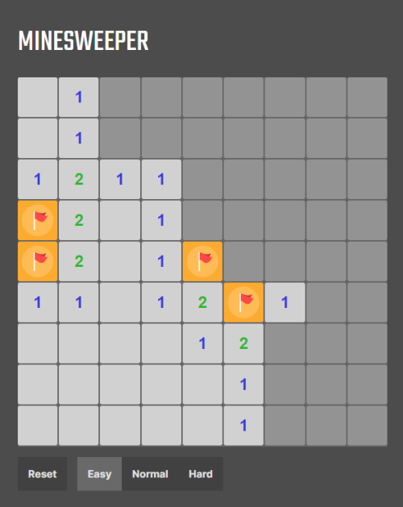

# vue-minesweeper

Minesweeper made with Vue 3.

## Play here

https://vue-msweeper.netlify.app/

## Looks like



## Project Setup

```sh
git clone https://github.com/miktolon/vue-minesweeper.git

cd vue-minesweeper

npm install
```

### Compile and Hot-Reload for Development

```sh
npm run dev
```

### Build

```sh
npm run build
```

### Licence

MIT